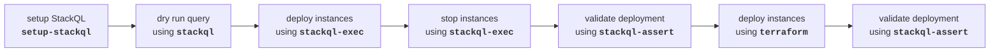

# StackQL GitHub Actions Demo

This repository demonstrates using [__StackQL__](https://github.com/stackql/stackql) with GitHub Actions.  StackQL can provision, de-provision, and perform lifecycle operations on cloud resources across all major cloud providers.  

StackQL GitHub Actions include:
- [__`setup-stackql`__](https://github.com/marketplace/actions/stackql-studios-setup-stackql) : Installs the `stackql` cli on actions runners, used if you want to perform custom operations using StackQL
- [__`stackql-exec`__](https://github.com/marketplace/actions/stackql-studios-stackql-exec) : Executes a StackQL query within an Actions workflow; this could be used to provision, de-provision, or perform lifecycle operations on cloud resources (using the [`INSERT`](https://stackql.io/docs/language-spec/insert), `UPDATE`, [`DELETE`](https://stackql.io/docs/language-spec/delete), [`EXEC`](https://stackql.io/docs/language-spec/exec) methods), as well as running queries and returning results to the log, file or variable (using the [`SELECT`](https://stackql.io/docs/language-spec/select) method)
- [__`stackql-assert`__](https://github.com/marketplace/actions/stackql-studios-stackql-assert) : Used to test assertions against the results of a StackQL query, this can be used to validate the state of a resource after an IaC or lifecycle operation has been performed, or to validate the system (e.g., CSPM or compliance queries) 

## Prerequisites

You will need to provide the necessary authentication to your target providers (using Actions secrets) and set the auth struct, which declares the providers you want to authenticate to in your StackQL query and what variables hold the relevant credentials for these providers (see [`stackql/auth.json`](stackql/auth.json)), this can also be supplied to any of the actions as a file using the `auth_obj_path` argument or from a string using the `auth_str` argument.  

## Demo workflow

The demo workflow in this repository is configured to run on a push to the `main` branch and performs the following steps:  



Workflow fragments are explained here:  

### setup StackQL

This step uses the [__`setup-stackql`__](https://github.com/marketplace/actions/stackql-studios-setup-stackql) action to install the `stackql` cli on the actions runner, which is then available to all subsequent steps in the job via `stackql`.  

```yaml
- name: setup StackQL
  uses: stackql/setup-stackql@v1.1.0
  with:
    use_wrapper: true
```

### dry run StackQL query

This step demonstrates how to use the `stackql` cli (after the previous `setup-stackql` action is used) to perform a dry run of a StackQL query - which will return a rendered template of your query with all of the fields populated; this is useful for debugging and validating your queries.  

```yaml
- name: dry run StackQL query
  shell: bash
  run: |
    stackql exec -i ./stackql/scripts/deploy-instances.iql --output text -H --dryrun
```
### deploy instances using `stackql-exec`

This step demonstrates how to use the [__`stackql-exec`__](https://github.com/marketplace/actions/stackql-studios-stackql-exec) method to perform a StackQL query; in this case, we are using the `INSERT` method to deploy instances on GCP.  

```yaml
- name: deploy instances using stackql-exec
  uses: stackql/stackql-exec@v1.0.1
  with:
   auth_obj_path: './stackql/auth.json'
   query_file_path: './stackql/scripts/deploy-instances.iql'
```

### stop running instances using `stackql-exec`

This step demonstrates how to use `stackql` via the `stackql-exec` action to perform lifecycle operations using StackQL (using the `EXEC` method).  

```yaml
- name: stop running instances using stackql-exec
  uses: stackql/stackql-exec@v1.0.1
  with:
    auth_obj_path: './stackql/auth.json'
    query_file_path: './stackql/scripts/stop-instances.iql'
```

### check if we have 4 instances using `stackql-assert`

This step demonstrates how to use the [__`stackql-assert`__](https://github.com/marketplace/actions/stackql-studios-stackql-assert) action to run a StackQL `SELECT` query and compare the actual result count with an expected result count, if there is a discrepancy then the action will fail.  

```yaml
- name: check if we have 4 instances using stackql-assert
  uses: stackql/stackql-assert@v1.0.2
  with:
    auth_obj_path: './stackql/auth.json'
    test_query_file_path: './stackql/scripts/check-instances.iql'
    expected_rows: 4
```

### check `terraform` deployment using `stackql-assert`

This step demonstrates how to use the `stackql-assert` action in a `terraform` deployment pipeline to run a StackQL `SELECT` query and compare the actual result with an expected result after a `terraform` deployment.  This can test specific configuration properties of the resource (for compliance or policy enforcement) or just the existence of the resource.

```yaml
- name: check terraform deployment using stackql-assert - should fail
  uses: stackql/stackql-assert@v1.0.2
  with:
    auth_obj_path: './stackql/auth.json'
    test_query_file_path: './stackql/scripts/check-terraform-instances.iql'
    expected_results_str: '[{"name":"terraform-test-1","name":"terraform-test-2"}]'
```

See [`.github/workflows/stackql.yml`](.github/workflows/stackql.yml) for the complete workflow file.
